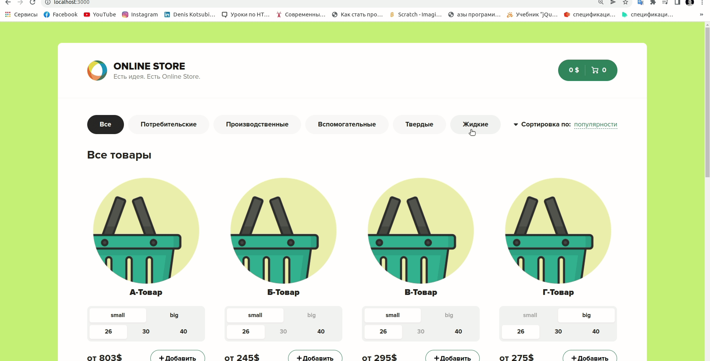
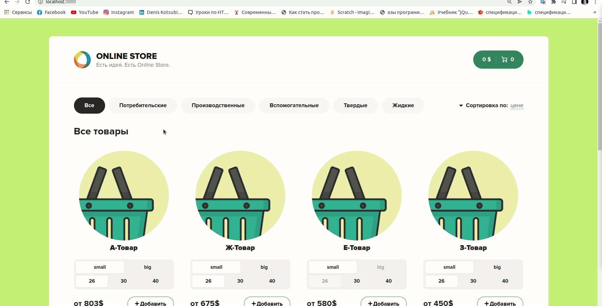

# Online Store
___

___
## Пример онлайн магазина
Проект создан с помощью [create-react-app ](https://create-react-app.dev/) и фейковой базой данных [json-server](https://github.com/typicode/json-server).


#### Для быстрого старта используем:
```
git clone https://github.com/deniskots/onlineStore.git

yarn

yarn server

yarn start
```
___
## Добавления товара в корзину
___

___
## Сортировка
___
